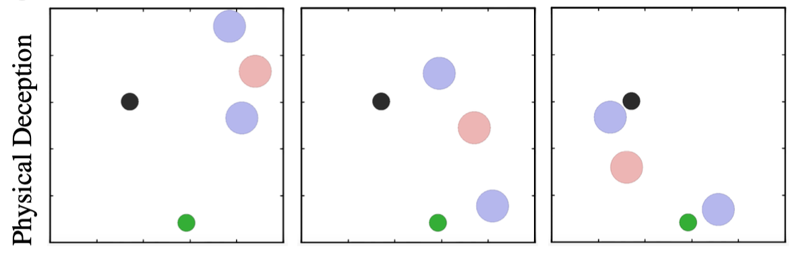
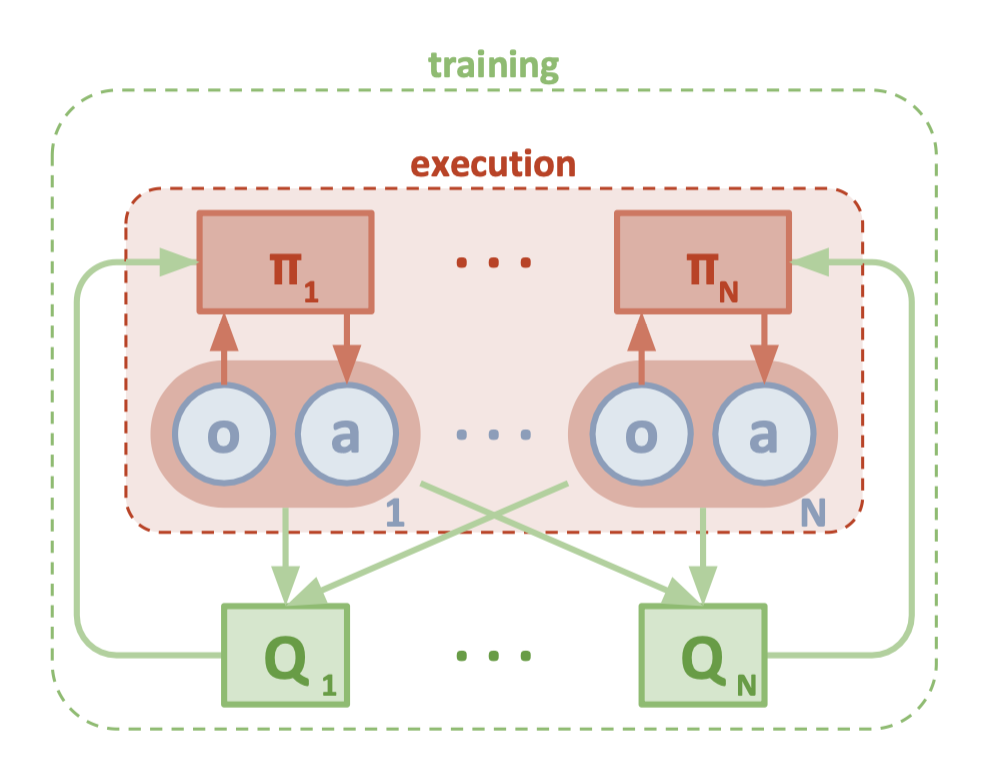

# Multi-Agent Deep Deterministic Policy Gradient (MADDPG)

This repository contains an implementation of MADDPG for cooperative-competitive multi-agent environments. The implementation is based on the paper ["Multi-Agent Actor-Critic for Mixed Cooperative-Competitive Environments"](https://arxiv.org/abs/1706.02275).

### Environment

The implementation uses a modified version of the Multi-Agent Particle Environment, specifically the "simple_adversary" scenario where:



- 2 good agents (blue) try to reach a target location
- 1 adversary agent (red) tries to prevent them from reaching the target

### Architecture



#### MADDPG Agent

- Implements centralized training with decentralized execution
- Each agent has its own actor and critic networks
- Critics have access to all agents' observations and actions
- Actors only access their own observations

#### Network Architecture

- Actor Network: 3-layer MLP with leaky ReLU activation
- Critic Network: 3-layer MLP with leaky ReLU activation
- Configurable hidden layer dimensions

#### Training Process

1. Collect experiences from parallel environments
2. Store transitions in replay buffer
3. Sample batch from buffer
4. Update critics using TD-error
5. Update actors using policy gradient
6. Soft update target networks

### Project Structure

```
src/
├── main.py          # Training script with configuration and training loop
├── render_trained_model.py  # Visualization script for trained models
├── env_wrapper.py   # Environment wrapper for parallel execution (SubprocVecEnv)
├── envs.py          # Environment setup and initialization functions
├── maddpg.py        # MADDPG algorithm core implementation
├── network.py       # Neural network architectures for Actor and Critic
├── utils.py         # Utility functions for tensor operations and updates
├── replay_buffer.py # Experience replay buffer implementation
├── multiagent/      # Multi-agent environment implementation
    └── scenarios/   # Different scenarios/tasks implementations
```

### Requirements

```bash
pip install -r requirements.txt
```

### Usage

#### Training

To train the agents:

```bash
python main.py
```

Key parameters in `main.py`:
- `parallel_envs`: Number of parallel environments (default: 8)
- `number_of_episodes`: Total number of training episodes (default: 30000)
- `episode_length`: Maximum steps per episode (default: 80)
- `save_interval`: Episodes between model saves (default: 1000)

#### Visualization

To visualize trained agents:

```bash
python render_trained_model.py
```

### Logging and Monitoring

Training progress can be monitored using TensorBoard:

```bash
tensorboard --logdir=log
```

Metrics logged:
- Actor loss
- Critic loss
- Mean episode rewards for each agent

### Save and Load

Models are automatically saved to `model_dir/` at specified intervals. Each save contains:
- Actor network parameters
- Critic network parameters
- Optimizer states

## License

MIT License

## Acknowledgments

This implementation is based on the MADDPG paper by Lowe et al. and uses components from OpenAI's Multi-Agent Particle Environment.
